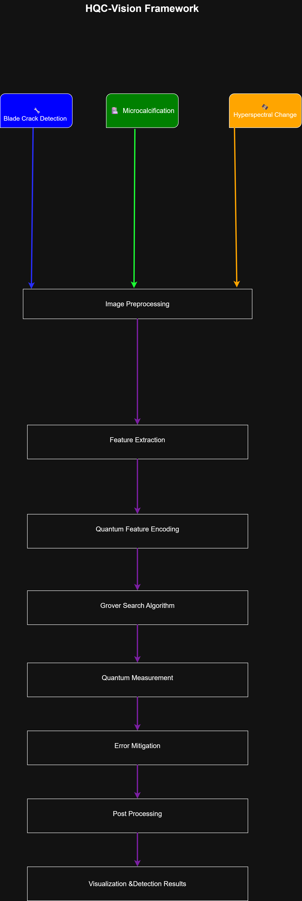

# 🧠 HQC-Vision

> Hybrid Quantum Computing Vision Framework for Industrial Inspection, Medical Imaging, and Hyperspectral Remote Sensing

<p align="center">


</p>

---

## 📖 Abstract

HQC-Vision is a modular Hybrid Quantum Computing framework integrating classical Computer Vision with Quantum Search algorithms to solve image analysis problems efficiently.

The framework demonstrates how Grover's Algorithm can be incorporated into Computer Vision pipelines for three different real-world applications:

- 🔧 Industrial Blade Crack Detection
- 🩺 Medical Microcalcification Detection
- 🛰️ Hyperspectral Change Detection

The framework is designed to be modular, scalable, and adaptable to future quantum hardware.
---

# 🏗️ Framework Architecture

<p align="center">



</p>

The HQC-Vision Framework follows a unified processing pipeline.

Three different application domains share the same Hybrid Quantum Computing workflow:

- Blade Crack Detection
- Microcalcification Detection
- Hyperspectral Change Detection

Each application passes through:

1. Image Preprocessing
2. Feature Extraction
3. Quantum Feature Encoding
4. Grover Search Algorithm
5. Quantum Measurement
6. Error Mitigation
7. Post Processing
8. Visualization & Detection Results

---

# ✨ Key Features

- Modular Architecture
- Hybrid Classical + Quantum Pipeline
- Grover Search based Image Analysis
- Qiskit Integration
- OpenCV Image Processing
- Medical Imaging Support
- Industrial Inspection
- Hyperspectral Remote Sensing
- Research Friendly Code Structure
---

# 🛠️ Technologies

| Category | Technology |
|-----------|------------|
| Language | Python |
| Quantum | Qiskit |
| Vision | OpenCV |
| Numerical | NumPy |
| Visualization | Matplotlib |
| Configuration | YAML |

## 📂 Repository Structure

```text
HQC-Vision
│
├── Blade Crack Detection/
│   ├── src/                  # Blade crack detection modules
│   ├── outputs/              # Detection results
│   ├── requirements.txt
│   ├── config.py
│   └── main.py
│
├── Hyperspectral Change Detection/
│   ├── modules/              # Quantum processing modules
│   ├── outputs/              # Generated change maps
│   ├── requirements.txt
│   ├── config.py
│   └── main.py
│
├── Microcalcification Detection/
│   ├── src/                  # Medical image processing modules
│   ├── outputs/              # Detection outputs
│   ├── dataset/              # Sample dataset structure
│   ├── requirements.txt
│   ├── config.yaml
│   └── main.py
│
├── docs/                     # Documentation
├── images/                   # Figures and screenshots
├── README.md
└── .gitignore
```

---

# 🚀 Future Work

- Quantum Convolutional Neural Networks
- Quantum Machine Learning Models
- Variational Quantum Circuits
- IBM Quantum Hardware Deployment
- Noise Adaptive Quantum Pipelines
- Multi-modal Medical Image Analysis

- ---

# 📚 Citation

If you use this repository for research or academic purposes, please cite the project appropriately.

---

# 📄 License

This project is released under the MIT License.
